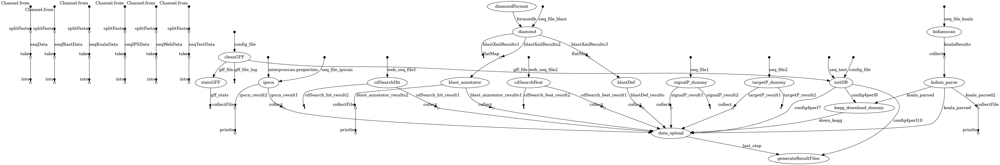

# FA-nf

[](https://zenodo.org/badge/latestdoi/209515370)

A pipeline for **functional annotation** of proteins from non-model organisms implemented in Nextflow engine.

The pipeline uses a set of well characterised software to assign functional information to the proteins of interests, i.e. domains, GO terms annotation, putative name and some other features.

The software used in this pipeline is mostly free software for academic users. For the software from the Center for Biological Sequence (CBS), i.e. signalP, a suitable license agreement should be obtained. More details about how to use this software in the *Associated containers* section at the end of this page.

## Installation
The pipeline is build on Nextflow as a woking engine, so it need to be installed first

```
 export NXF_VER=20.10.0; curl -s https://get.nextflow.io | bash
```
The detailed procedure is described in the [Nextflow documentation](https://www.nextflow.io/docs/latest/getstarted.html)

## Running the pipeline

The annotation itself, when various software is excuted and the results are stored in an internal database.

Result files, including a main annotation file in gff format and annotation report, are generated at the end of the pipeline.

The annotation step can be launched by using the following command:

```
./nextflow run -bg main.nf --config params.config &> logfile
```

## Pipeline parameters

### `-resume`
This Nextflow build-in parameter allow to re-execute processes that has changed or crashed during the pipeline run. Only processes that not finished will be executed.
More information can be found in the [Nextflow documentation](https://www.nextflow.io/docs/latest/getstarted.html#modify-and-resume)

### `-config`
The pipeline require as an input the configuration file with specified parameters, such as path to the input files, species name, KEGG species abbreviations used to obtain KO groups, and some more.

The example of configuration file is included into this repository with name ```params.config```

Most parameters are self-explanatory. We highlight some below and in upcoming sections:

```
  // Protein fasta input
  proteinFile = "${baseDir}/dataset/P.vulgaris.proteins.fa"
  // GFF input
  gffFile = "${baseDir}/dataset/P.vulgaris.gff3"
```

When approaching a new dataset, we suggest to run first the pipeline in **debug** mode (provided as such in example params config). This will analyze a limited number of protein entries. This way you may save time and troubleshoot some potential problems in your input files.

```
  // Whether to run pipeline in debug mode or not
  debug = "true"
```

One of the strenghts of Nextflow is allowing the parallelization and merging of several processes. In our case, input protein FASTA file is split and its sequences are delievered to the different used applications in chunks. For a quick processing, the optimal size of these chunks is not the same for each target application, and it can also depend on the setup of your HPC environment or network health. This can be tuned using the parameters below:

```
  // Number of protein sequences per chunk (used as fallback)
  chunkSize = 25
  // Number of protein sequences per chunk when using BLAST (or DIAMOND)
  chunkBlastSize = 50
  // Number of protein sequences per chunk when using InterProScan
  chunkIPSSize = 25
  // Number of protein sequences per chunk when using KofamKOALA
  chunkKoalaSize = 50
  // Number of protein sequences per chunk when submitting to web processes (CD-Search for now)
  chunkWebSize = 100
  // Number of chunks to be used when running in debug mode (e.g., for facllback processes this would be 5*25=125 protein sequences)
  debugSize = 5
```

## Pipeline steps



* **cleanGFF**: it cleans input GFF if enabled
* **statsGFF**: it provides some general statistics on the GFF input
* **blast**: it perfoms BLAST search against defined database from input files
* **diamond**: the same as above but using DIAMOND ( ```diamond = "true"``` in config file )
* **ipscn**: it performs InterProScan analyses from input files
* **signalP**: it performs signalP analyses from input files
* **targetP**: it performs targetP analyses from input files
* **blast_annotator**: it retrieves GO terms from BLAST hits
* **blastDef**: it attaches a definition to input entries based on BLAST hits
* **cdSearchHit**: it performs a NCBI CDSearch Hit query
* **cdSearchFeat**: it performs a NCBI CDSearch Feature query
* **initDB**: it initialitzes the database used for gathering data from different analyses and later generating the reports. Starting inputs are FASTA and GFF files
* **definition_upload**: it uploads definitions derived from BLAST into the DB
* **signalP_upload**: it uploads signalP analyses into the DB
* **targetP_upload**: it uploads targetP analyses into the DB
* **CDSearch_hit_upload**: : it uploads NCBI CDSearch Hit analyses into the DB
* **CDSearch_feat_upload**: it uploads NCBI CDSearch Feature analyses into the DB
* **blast_annotator_upload**: it uploads GO terms from BLAST hits into the DB
* **kegg_download**: it downloads KO (Kegg Ortholog) from KEGG
* **kegg_upload**: it retrieves and uploads KEGG data (either from a KAAS file or KofamKOALA) into the DB
* **generateResultFiles**: it generates report files
* **generateGFF3File**: if GFF provided as input, it provides a modified GFF with additional information from the previous annotation steps

### GFF preparation

Despite [some existing recommendations](https://github.com/The-Sequence-Ontology/Specifications/blob/master/gff3.md), there is a huge diversity of GFF formats in the wild. For safety reasons, we introduce an initial step, thanks to [AGAT toolkit](https://github.com/NBISweden/AGAT), (which can be disabled with ```gffclean = "false" ```) for ensuring that GFF input files will be properly processed.

We suggest to check **annot.gff**, **annot.gff.clean.txt** and **annot.gff.stats.txt** files in results directory and generated during the first steps of the pipeline, for checking that used GFF files are OK.

### BLAST databases

* For NCBI BLAST+: ```blastDbPath = "/path/to/db"``` and ```diamond = "false"```. It looks for formatted database files (normally named ``db.p*`` for protein type based ones), otherwise it will try to format FASTA file with that name
* For DIAMOND: ```blastDbPath = "/path/to/db"``` and ```diamond = "true"```. It looks for a single formatted database file (normally named ``db.dmnd``), otherwise it will try to format the FASTA file with that name (gzip compressed files accepted)

### Retrieval of GO terms from BLAST results

Retrieval of GO terms from BLAST results can be performed either from [BLAST2GO](https://www.blast2go.com/) results or from other methods as far as a BLAST2GO-compatible output format is provided.

Moreover, we are also providing a web API for retrieving protein-GO mapping from [UniProt GOA](https://www.ebi.ac.uk/GOA) and other resources. More details for [for setting an own instance here](https://github.com/toniher/gogoAPI).

When using the second option, you can tune it with the parameters below:

```
  // Instance from where to retrieve GO mappings
  gogourl = "http://myinstance.example.com/api"
  // Maximum number of hits to consider (up to 30 by default))
  gogohits = 30
  // Modes of retrieval from BLAST matches
  //  * Common: Only GO entries appearing in all matches
  //  * Most: Only GO entries appearing in more than half of matches
  //  * All: All GO entries appearing in all matches
  blastAnnotMode = "common"
```

### KEGG orthology groups
Predictions of the KEGG orthology groups (KO) can be obtained outside of the pipeline, i.e. via [KAAS server](http://www.genome.jp/tools/kaas/) or using a previously set-up version of [KofamKOALA](https://www.genome.jp/tools/kofamkoala/).

For KofamKOLA, adjust the parameters below to match the location in your system ([FTP source](ftp://ftp.genome.jp/pub/db/kofam/))

```
  kolist = "/nfs/db/kegg/ko_list"
  koprofiles = "/nfs/db/kegg/profiles"
  koentries = "/nfs/db/kegg/ko_store"
```

In the parameters above, ```koentries``` refers to a directory containing KO entries text files that can be downloaded in advance (check *Dataset resources* section below).

**Note**: when using KAAS, for the downstream processing of the KO file it is very important to store information about species used for predictions. Species are encoded in three letters abbreviations, and the list can be copied from the 'Selected organisms' field in the kaas_main form.

### Skipping some analyses

Future versions of this pipeline might allow to control in more detail which applications to run. For now, it is possible to skip some of them: *cdSearch* (hit and features retrieval), *signalP* and *targetP*. For the first case, since it is a web process, it can be time-consuming in some HPC setups. For the last two cases, since [preparing a container with privative software]((https://github.com/biocorecrg/sigtarp_docker)) can be troublesome or problematic, it can also be skipped. It is worth noting that some CD-Search data is actually available in InterPro.


For skipping these applications, the following lines can be added in the configuration file:

```
  skip_cdSearch = true
  skip_sigtarp  = true
```

### Dataset resources

For downloading and formatting diferent datasets used by the programs part of this pipeline, [some scripts are provided here](https://github.com/toniher/biomirror/) for convenience.

## Result files

Below you can check all the possibly available files in results directory (defined with ```resultPath``` parameter) at the end of the pipeline execution. Some files may not be there if certain options are switched (e.g., if GFF cleaning is skipped with ```gffclean = "false"```).

* **«myorg».gff**: final outcome GFF that adds retrieved annotation information to the provided GFF. Filename matches the ```dbname``` parameter
* **annot.gff**: input GFF file after being cleaned at the beginning of the pipeline and used in downstream processes
* **annot.gff.clean.txt**: GFF cleaning log information
* **annot.gff.stats.txt**: GFF input file statistics
* **annotatedVsnot.png**: summary chart with protein length distribution and annotation coverage
* **go_terms_byGene.tsv**: TSV file containing a list of genes, and all the GO codes assigned to the proteins associated to that gene and the different methods (e.g., KEGG)
* **go_terms.tsv**: TSV file containing a list of proteins with their assigned GO codes with the used methods
* **interProScan.res.tsv**: TSV file with all protein domain and signature matches using InterproScan
* **protein_definition.tsv**: TSV file with assigned protein definition and the method uses (e.g., using BLAST matches)
* **signalP.res.tsv**: TSV file with all SignalP predictions
* **targetP.res.tsv**: TSV file with all TargetP predictions
* **total_stats.txt**: Annotation coverage provided at the end of the pipeline execution


## Running in MySQL mode

Running in MySQL mode improves the speed of the pipeline, but some care must be taken for including connection details in the configuration.

The relevant paremetres below:

```  
    # Database engine. Specify MySQL (otherwise 'SQLite' will be used)
    dbEngine = "MySQL"
    # Database name. If it does not exist, if the user has enough permissions it will be created
    dbname = "Pvulgaris"
    # Database user name
    dbuser = "test"
    # Database user password
    dbpass = "test"
    # Port of the MySQL engine (3306 default)
    dbport = 12345
    # The host where the MySQL engine is located. Skip it if using the wrapper below
    dbhost = 0.0.0.0
    # If using the wrapper below, where MySQL data will be stored
    mysqldata = "${baseDir}/mysql/"
    # If using the wrapper below, where MySQL instance logs will be stored
    mysqllog = "${baseDir}/tmp/"
    # If using the wrapper below, which Singularity/Docker image will be used
    mysqlimg = "docker://library/mariadb:10.3"
```

**Note**: when running a different analysis, take care to use a different ```dbname``` for avoiding unexpected problems.  

### Execution without an ad-hoc database

We offer a convenience wrapper script for running the pipeline in MySQL mode either in SGE-compatible clusters or in local without having to set up any MySQL server and database before thanks to Singularity.

    nohup perl run_pipeline_mysql.pl -conf ./params.config  &> log.mysql &

It is also possible to pass additional Nextflow parameters

    nohup perl run_pipeline_mysql.pl -params "-with-dag -with-report -with-timeline" -conf ./params.config  &> log.mysql &


#### Inspection of MySQL database

If run without an ad-hoc database, this is convenient for checking results database once analyses are finished. NO further analyses are run.

	nohup perl run_pipeline_mysql.pl -mysqlonly -conf ./params.config &> log.mysql.only &


for further options or details, run:

    perl run_pipeline_mysql.pl -h


## Associated containers

We recommend installing either [Docker](https://www.docker.com/) or [Singularity](https://sylabs.io/singularity/) (the latter preferred).

The software used all along this pipeline is encapsulated in several containers:

As written down in ```nextflow.config``` file, whenever possible, we try to provide necessary images in a public repository (e.g. [Docker hub](https://hub.docker.com/) or quay.io from [Biocontainers](https://biocontainers.pro/)). However, for some software that includes privative components, we suggest to build the container image by yourself.

* [SignalP and TargetP](https://github.com/biocorecrg/sigtarp_docker) (user needs to build container image first. Please check **sigtarp** process in ```nextflow.config```)
* [Interproscan and 3rd party tools](https://github.com/biocorecrg/interproscan_docker) (user needs to build container image fisrt. Please check **ipscan** process in ```nextflow.config```. Two versions are available: one with privative software and one without)

### How to build base container

The base container is [available in Docker Hub](https://hub.docker.com/r/guigolab/fa-nf) and Nextflow takes care automatically to retrieve it form there, but you can always decide to generate it yourself.

```
    # Generate Docker image
    docker build -t fa-nf .

    # Generate Singularity image if preferred
    sudo singularity build fa-nf.sif docker-daemon://fa-nf:latest
```

## Troubleshooting

**At the beginning of the pipeline execution, I get an error message such as ```FATAL:   While making image from oci registry: while building SIF from layers: conveyor failed to get: no descriptor found for reference``` or any other mentioning OCI, SIF or Singularity.**

*Ensure you have an up-to-date version of Singularity. Otherwise you may need to clean some Singularity directories, the singularity one (where pipeline images are stored) in FA-nf base directory and ```.singularity``` in your ```$HOME``` directory.*


**Just after starting the pipeline, it stops and I get a message such as ```Something went wrong. No supported configuration file syntax found at /your/path/lib/site_perl/5.26.2/Config/Simple.pm line 184, <FH> line 23.```**

*Check line **23** (or the number you have) of your params.config if you have any syntax error (e.g., new line, additional quote character, etc.)*


**Despite it ran successfully, the pipeline did not process the whole dataset but just a small part of it**

*You may have run it in debug mode. Check your params file and change it to ```debug = 'false'```*

**After several retries, a process stops and the pipeline finishes unsucessfully**

*You may need to assign more time, CPU or memory to the involved process from ```nextflow.config``` file. If it keeps failing you may need to check input files (e.g., there may be sequences of anomalous length). Otherwise, submit an issue in this Github repo detailing your problem.*

**When using MySQL database mode with Singularity wrapper, it does not start and it complains it is locked**

*Ensure no Singularity process is running on the contents of the selected MySQL directory. If it is not the case and it is still failing, copy the contents in another directory and run it from there instead*

**My HPC infrastructure cannot access the Internet. Can I use the pipeline?**

*Yes, as far as you skip CD-Search analyses (```skip_cdSearch = true```), you can use it by pre-downloading container images first (assuming Singularity) and replacing container values in ```nextflow.config``` for their path in your filesystem. You can download singularity images for latter placing them in your filesystem with a command like this: ```singularity pull kofamscan-1.2.0.sif docker://quay.io/biocontainers/kofamscan:1.2.0--0```.*
